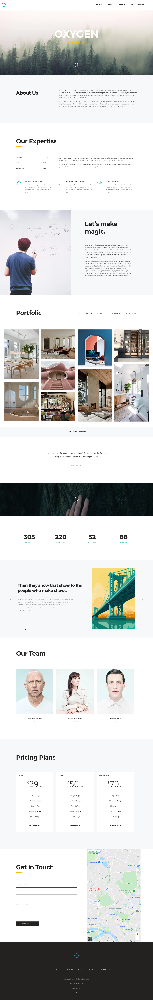

# Design agency landing page 

This is a pet project using flexbox, grid and jquery.

## Table of contents

- [Overview](#overview)
  - [The purpose](#the-purpose)
  - [Screenshot](#screenshot)
  - [Links](#links)
- [My process](#my-process)
  - [Built with](#built-with)
- [Author](#author)

## Overview

### The purpose

Users should be able to:

- View the optimal layout for the site depending on their device's screen size
- See hover states for all interactive elements on the page

### Screenshot

### Links

- Live Site URL: (https://tatyanatropkina.github.io/Oxygen/)

## My process

### Built with

- Semantic HTML5 markup
- Bem methodology
- CSS custom properties
- Flexbox
- CSS Grid
- [Jquery](https://jquery.com/) - JS library
- [Slick slider](https://kenwheeler.github.io/slick/) - JS plugin
- [MixitUp](https://www.kunkalabs.com/mixitup/) - JS plugin
- [Animate](https://animate.style/) - CSS animation library 
- [Wowjs](https://wowjs.uk/) - JS library

### Continued development

## Author

- Frontend Mentor - [@TatyanaTropkina](https://www.frontendmentor.io/profile/TatyanaTropkina)
- GitHub - [@TatyanaTropkina](https://github.com/TatyanaTropkina)
